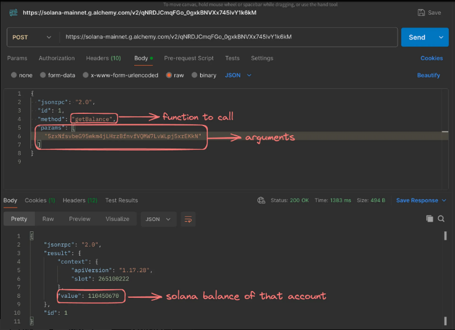

# rpc - remote procedure calls

rpc is like 
when we used to do
const response  = await axios.get("",{
    .....
})

wouldnt it be nice if there is a function called getData and we call it and it gets the job done for the above

that is called rpc where all the logic is written somewhre else and we call it in other place to make things easier 

benifits rpcs provides are >>

better types that we get from the response

we arre stll using json but that s okay grpc solves it later (json is slow af)

if we can get autogenerated code for all languages , then this becmes language agniostic

rpc call under the hood>>>

in an rpc this reques looks mostly like this
tthey dont expect you to mmention any route like getTodos , getBalanmce
the url remaions the same  , just the method inside the request changes 
which does the job done

this is the kind of body and kind of body we get will doing rpc
notice that we are not putting any route there
the url remains the same>
in the body there is a jsonrpc that means it is doing a rpc call
adn there is the method we wnat that is the getBalance , we want to get the balamce so in the rpc body we will pass the method
and also in the params that is the argument we want to pass it to the other side 

# grpc

another bad thing about node express servers are that the data getting back from a response has the type any
anad when ur software is at a large scale and it has multiple backends and data needs to go from one be to another be and so on
or backend written in other languages too then it becomes very difficult to infer types of the data coming from the other backend
and often resukt to compile time errors in the prod at high scale
this is another use case where grpc comes into the picture at scale

Json is very slow and it is very big 

it compresses thee data that are being transferred to and frowth and that resukts in high computation and faster servers
it narrow downs the bandwidth cost of the servers computations
and we can use smaller ec2 machines for grpc servers as they are very fsat and good 

so grpc lets you do remote procedure calls
and it reduces the data transfer(proroBuffs) layer compressed